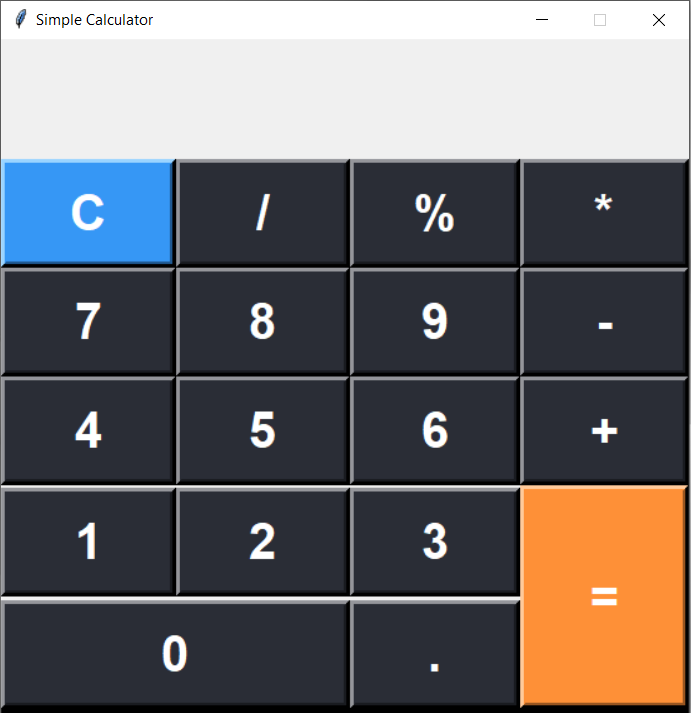

**Project name:**  
My Simple Calculator

  

This is a simple Python calculator project using tkinter library to create a GUI application that allows you to perform basic arithmetic calculations. The calculator has been converted into an executable (.exe) application for easy and convenient use.

**Features:**  

* Addition, subtraction, multiplication, and division operations.
* Support for both whole numbers and decimal numbers.
* User-friendly interface with an easy-to-use layout.

**Instructions:**  

1) Download the repository content and store it on your local device.
2) To use the (.exe) application, access the file 'dist/MySimpleCalculator/MySimpleCalculator.exe'. You can also create a shortcut for this file and drag it to a wanted directory.
3) Run the calculator.exe application on your Windows computer.
4) Enter the numbers and choose the desired operation using the provided buttons.
5) Press the "=" button to get the result of the calculation.
6) Clear the input by pressing the "C" button.
